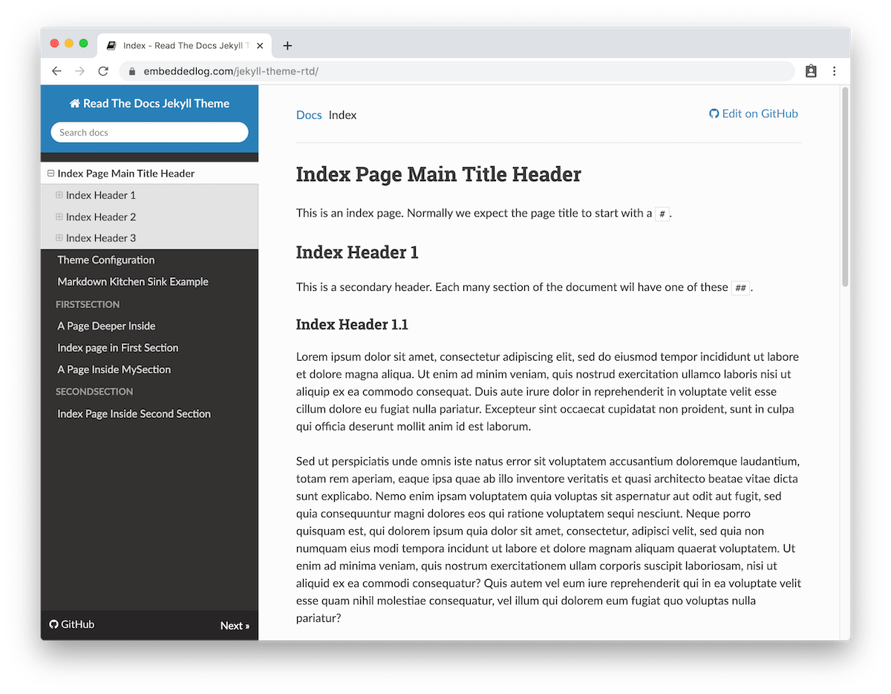

# Read The Docs Theme for Jekyll and GitHub Pages

This is a port of the
Some inline Latex: $$a^2 + b^2 = c^2$$

ABC = $$x^2$$
$$a^2 + b^2 = c^2$$
$$a^2 + b^2 = c^2$$
$$\frac{\partial u_{2:N}}{\partial t} = D_{s,i}(T)Au_{2:N}  + Bj_i(t)$$
$$\frac{\partial z_{2:N}}{\partial t} = D_{s,i}(T)V^{-1}\Lambda Vz_{2:N}  + \tilde{B}j_i(t)$$
$$\frac{\partial u_{2:N}}{\partial t} = D_{s,i}(T)V^{-1}\Lambda Vu_{2:N}  + VBj_i(t)$$
$$    \frac{\partial z_{2:N}}{\partial t} = D_{s,i}(T) \tilde{A}_iz_{2:N}  + \tilde{B}_ij_i(t) \\
    c_i = \begin{bmatrix} \tilde{C}_iz_{i,2:N} + \frac{\tilde{D}_ij_i(t)}{D_{s,i(T)}} \\ \tilde{C}_{i,c} \left( \tilde{C}_{i}z_{i,2:N} +  \frac{\tilde{D}_ij_i(t)}{D_{s,i(T)}} \right) + \frac{j_i(t)D_{s,i}(T)}{\tilde{D}_i} \end{bmatrix}$$

[Read The Docs](https://sphinx-rtd-theme.readthedocs.io) theme to
[Jekyll](https://jekyllrb.com/), so that it can be used with GitHub Pages.

You are previewing the theme right now, as you navigate
[this documentation](https://carlosperate.github.io/jekyll-theme-rtd):

The original [Read The Docs](https://readthedocs.org)
[theme]((https://sphinx-rtd-theme.readthedocs.io)) was created for the
[Sphinx](https://www.sphinx-doc.org/) documentation generator, and so it is
designed specifically for docs.

Combined with [GitHub Pages](https://pages.github.com) it's a great and easy
way to document your projects!

## What Can You Find Around Here

- Check out the [Quick Start Guide](https://carlosperate.github.io/jekyll-theme-rtd/quickstart.html) to get up and running.
- If some of the terms thrown around here don't make a lot of sense, check out the [What is All This? (FAQs)](https://carlosperate.github.io/jekyll-theme-rtd/faqs.html) page.
- To find out more about all the theme available options see the
  [Theme Configuration](https://carlosperate.github.io/jekyll-theme-rtd/configuration/configyml.html)
  and the [Pages Configuration](https://carlosperate.github.io/jekyll-theme-rtd/configuration/frontmatter.html)
  pages.

## 🚧 Warning!

This theme is currently a **Work-In-Progress** but, while some things might be
broken, it should be already usable.

Missing features are listed in the GitHub issues with the
[to-do label](https://github.com/carlosperate/jekyll-theme-rtd/issues?q=is%3Aissue+is%3Aopen+label%3Ato-do),
and any known issues are listed with the
[bug label](https://github.com/carlosperate/jekyll-theme-rtd/issues?q=is%3Aissue+is%3Aopen+label%3Abug).

Contributions are very welcomed!
